# 📚 LiterAlura - Catálogo de Libros y Autores


LiterAlura es una aplicación de consola desarrollada en **Java con Spring Boot** que permite buscar, catalogar y analizar libros y autores consumiendo la API pública de **Gutendex**. Este proyecto es el desafío final de la especialización Backend del programa **Oracle Next Education (ONE)** en alianza con **Alura Latam**.

## 🚀 Características Principales

La aplicación cuenta con una interfaz de consola interactiva (estilizada con códigos ANSI) que ofrece las siguientes funcionalidades:

1. **Búsqueda en tiempo real:** Consumo de la API de Gutendex para buscar libros por título o autor.
2. **Persistencia de datos:** Guardado automático de libros y autores en una base de datos relacional evitando duplicados.
3. **Catálogo local:** Listado completo de libros y autores registrados en la base de datos.
4. **Filtro temporal de autores:** Búsqueda de autores vivos en un año específico mediante _Derived Queries_ complejas.
5. **Menú Dinámico de Idiomas:** Generación automática de un menú interactivo basado exclusivamente en los idiomas que ya existen en la base de datos. Utiliza la clase nativa `Locale` de Java para traducir en tiempo real los códigos de idioma (ej: "en") a sus nombres completos capitalizados en español ("Inglés").
6. **Búsqueda anidada:** Localización de libros a partir del nombre de un autor registrado.
7. **Top 10:** Ranking de los libros más descargados.
8. **Estadísticas Globales:** Análisis de la base de datos (promedios, máximos y mínimos de descargas) utilizando `DoubleSummaryStatistics` y Java Streams.

## 🛠️ Tecnologías y Herramientas

* **Lenguaje:** Java 
* **Framework:** Spring Boot (Data JPA)
* **Base de Datos:** PostgreSQL
* **Mapeo de Datos:** Jackson (`@JsonAlias`, `@JsonIgnoreProperties`)
* **Cliente HTTP:** `java.net.http.HttpClient` nativo de Java
* **Gestor de dependencias:** Maven

## 🧠 Desafíos Técnicos Superados

Durante el desarrollo de este proyecto, se implementaron soluciones a problemas arquitectónicos y lógicos avanzados:

* **Arquitectura en Capas (Clean Code):** Se refactorizó la aplicación para separar la lógica de presentación (`Principal.java`) de la lógica de negocio, delegando toda la gestión de base de datos a una capa de servicio (`ServicioLibro.java`), respetando el **Principio de Responsabilidad Única (SRP)**.
* **Relaciones Bidireccionales JPA:** Configuración precisa de relaciones `@ManyToMany` entre `Libro` y `Autor`. Se resolvió el problema de inserción de entidades desvinculadas (*Detached Entity*) gestionando correctamente los estados con `CascadeType.MERGE`.
* **Manejo de Duplicados:** Implementación de lógica transaccional para verificar la preexistencia de autores en la base de datos antes de persistir un nuevo libro, optimizando el almacenamiento y manteniendo la integridad referencial.
* **Mapeo de JSON anidado:** Transformación de respuestas complejas de la API hacia Java `Records` y su posterior conversión a entidades JPA.
* **Generación de UI Dinámica en Consola:** Implementación de menús autogenerados que leen los registros únicos de la base de datos (ej. idiomas disponibles) y formatean la salida para el usuario, evitando opciones vacías o quemadas en el código (hardcoding).

## ⚙️ Configuración e Instalación

1. Clona este repositorio:
   ```bash
   git clone [https://github.com/yerkoppp/literalura.git](https://github.com/yerkoppp/literalura.git)
3. Configura tu base de datos PostgreSQL. Crea una base de datos llamada literalura.

3. Configura las variables de entorno en tu IDE o modifica el archivo src/main/resources/application.properties con tus credenciales:

   ```bash
   spring.datasource.url=jdbc:postgresql://localhost/literalura
   spring.datasource.username=TU_USUARIO
   spring.datasource.password=TU_CONTRASEÑA
   ````
   Ejecuta la aplicación desde tu IDE o mediante Maven:
   ```bash
   ./mvnw spring-boot:run
   ```

## 📸 Galería de la Aplicación

<table>
  <tr>
    <td align="center">
      <b>Arranque y Menú</b><br>
      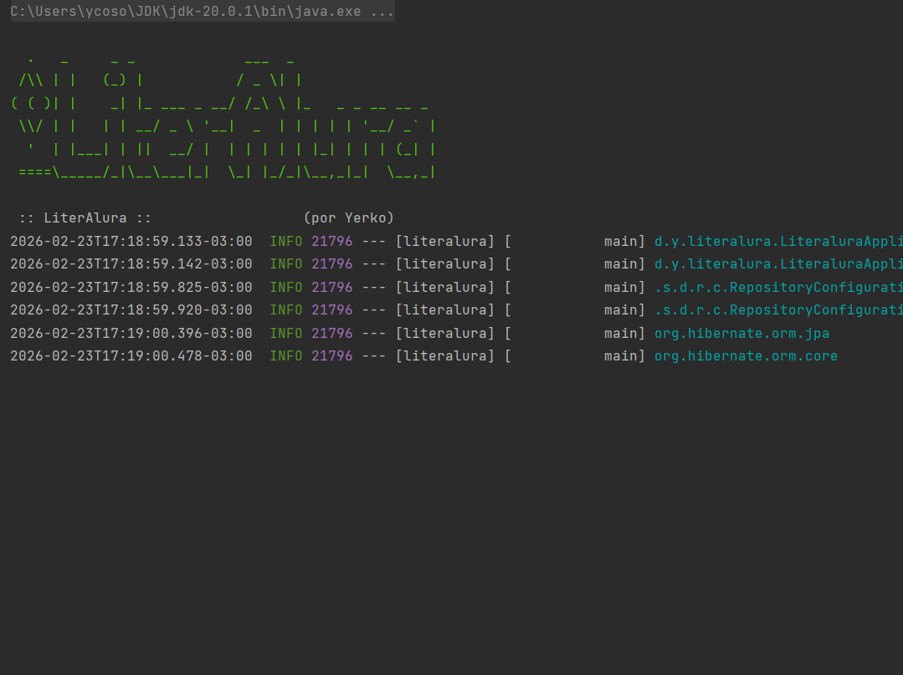
    </td>
    <td align="center">
      <b>Menú Principal</b><br>
      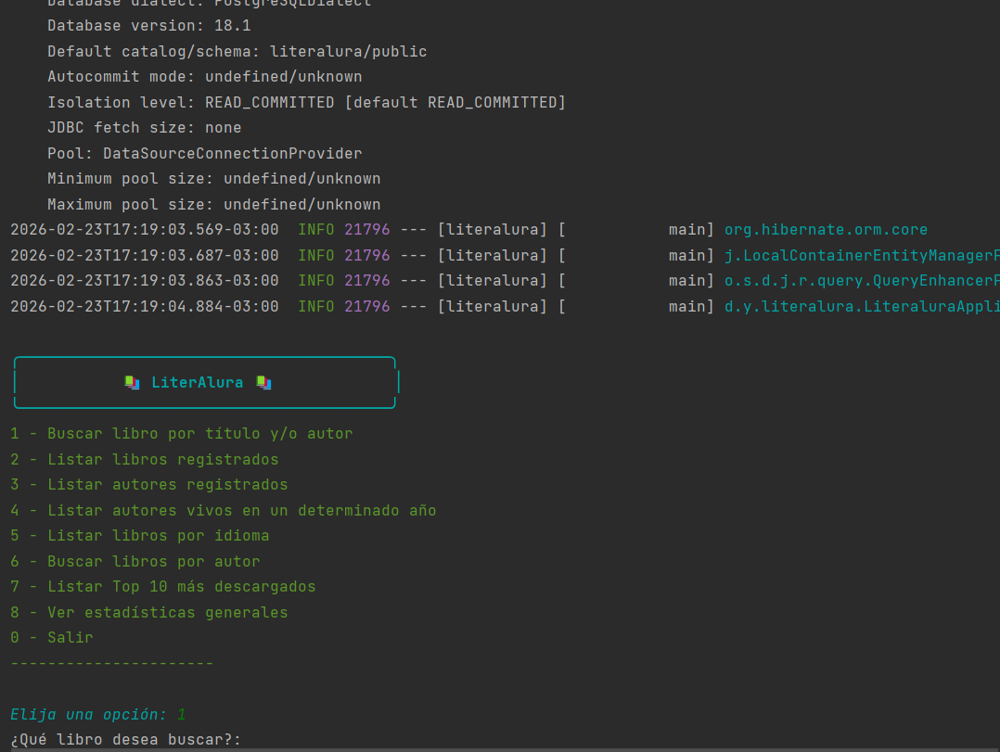
    </td>
  </tr>
  <tr>
    <td align="center">
      <b>Búsqueda Exitosa</b><br>
      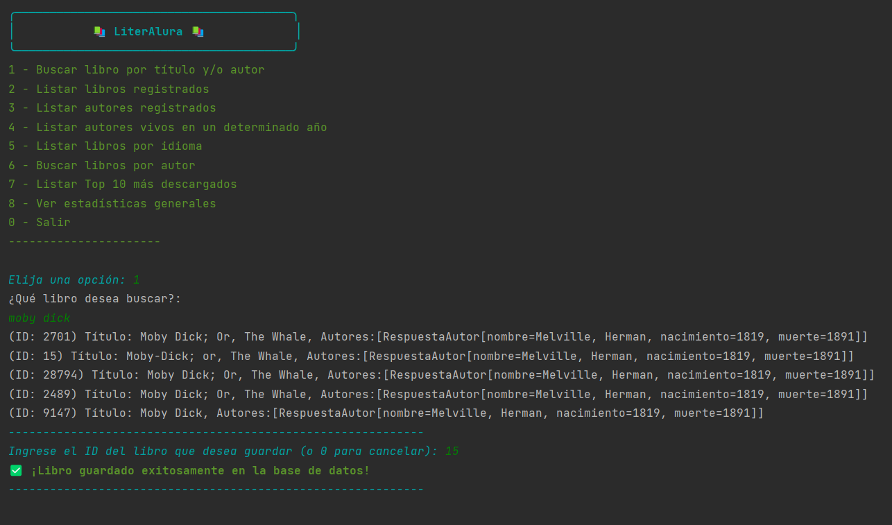
    </td>
    <td align="center">
      <b>Filtro Dinámico de Idiomas</b><br>
      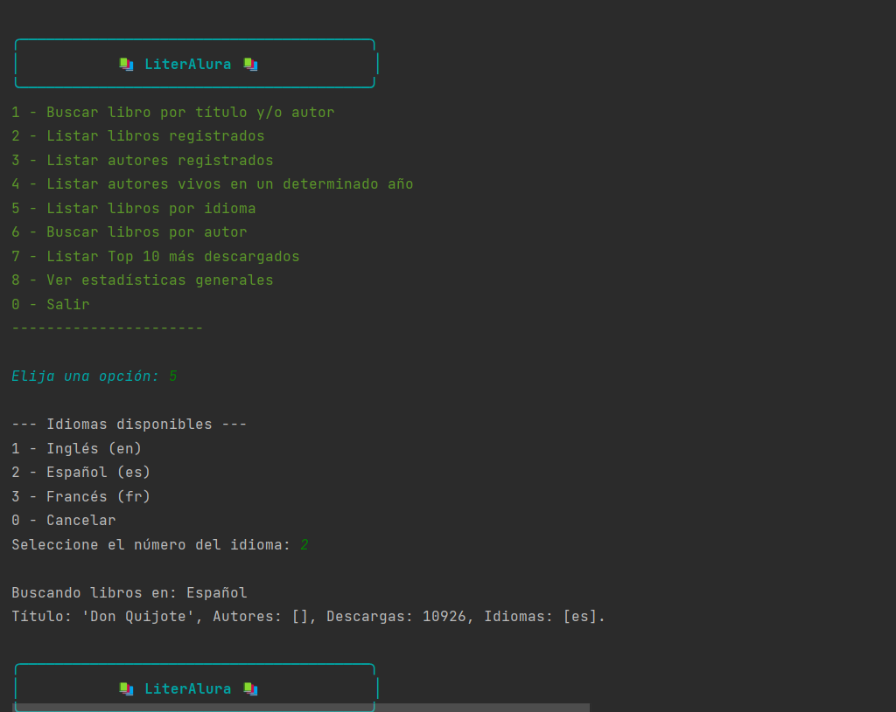
    </td>
  </tr>
  <tr>
    <td align="center">
      <b>Libros Registrados</b><br>
      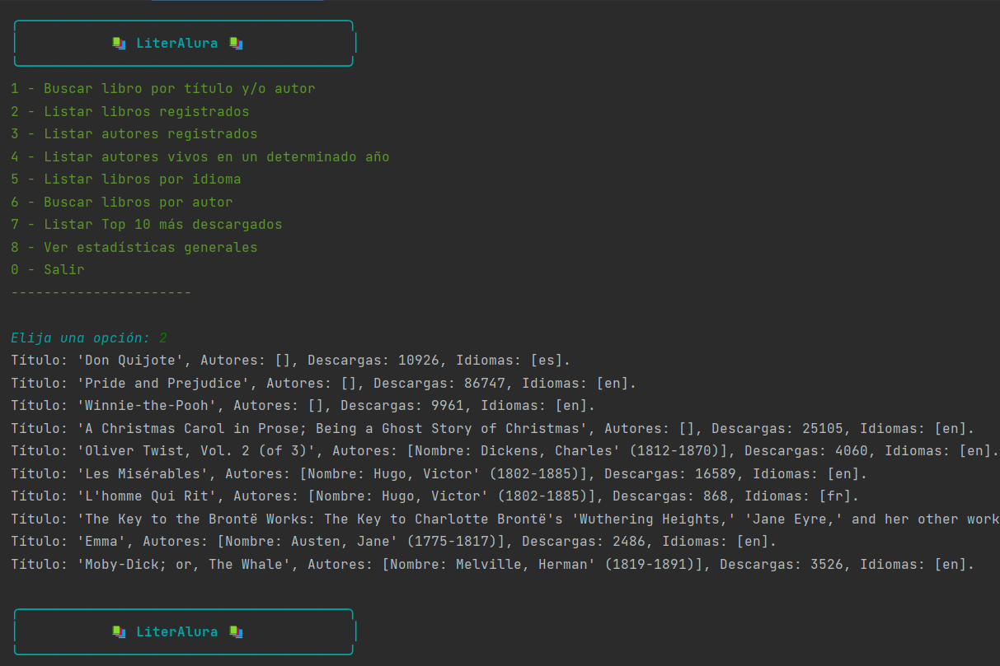
    </td>
    <td align="center">
      <b>Autores Registrados</b><br>
      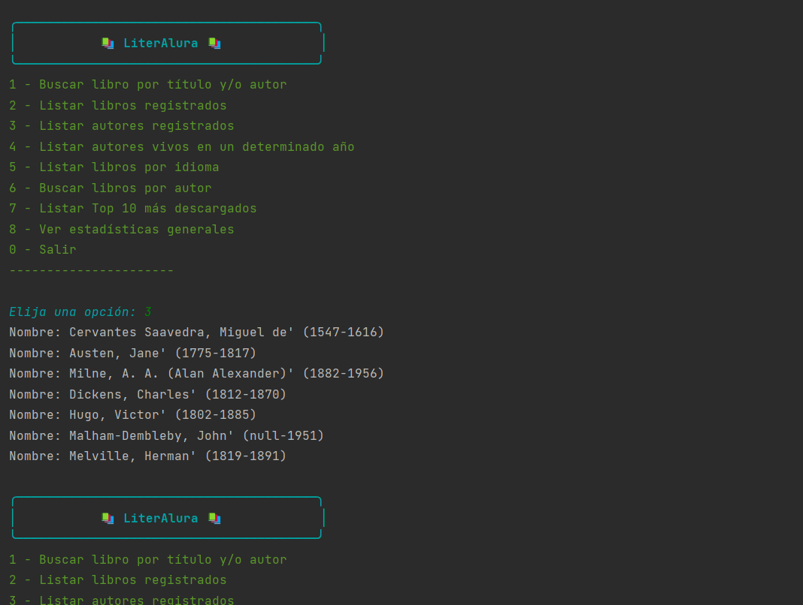
    </td>
  </tr>
  <tr>
    <td align="center">
      <b>Autores Vivos por Año</b><br>
      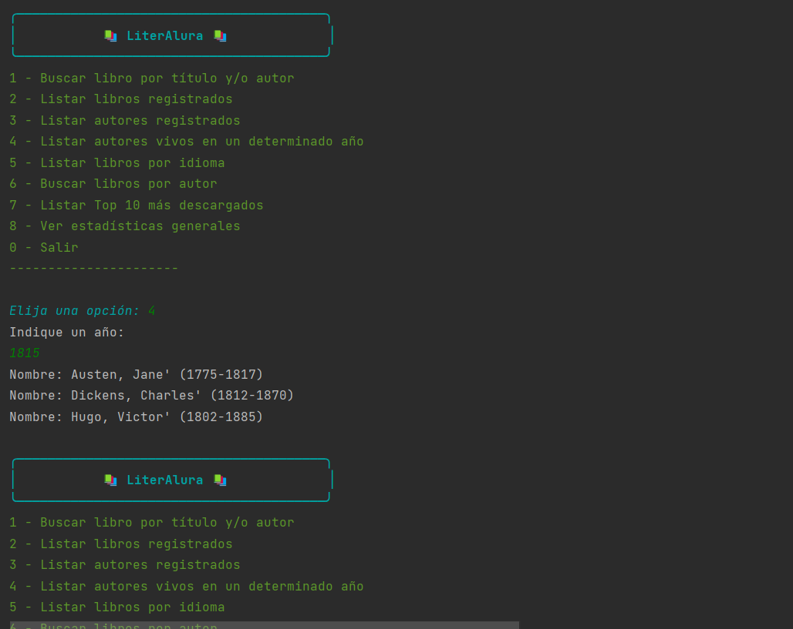
    </td>
    <td align="center">
      <b>Búsqueda Anidada por Autor</b><br>
      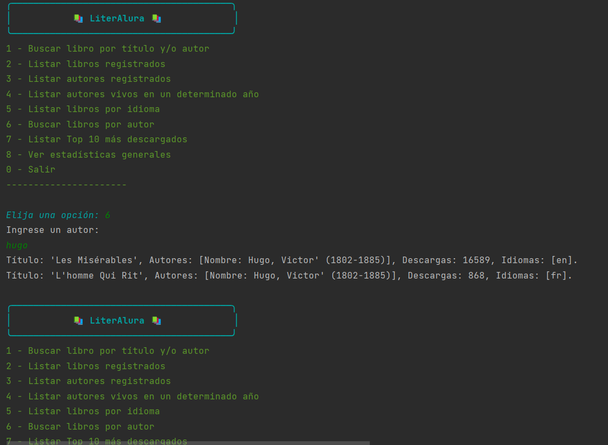
    </td>
  </tr>
  <tr>
    <td align="center">
      <b>Top 10 Descargas</b><br>
      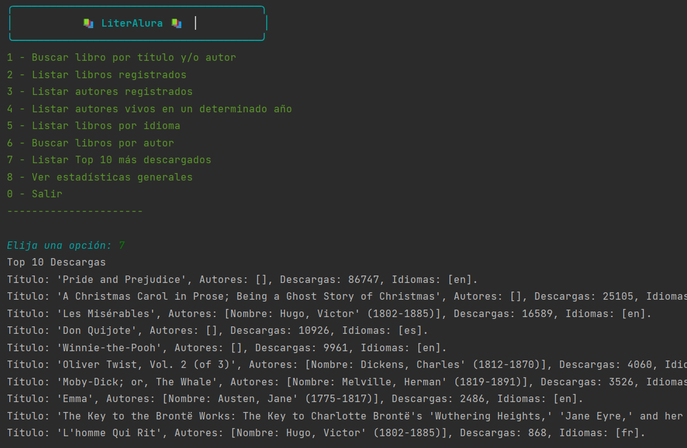
    </td>
    <td align="center">
      <b>Reporte de Estadísticas</b><br>
      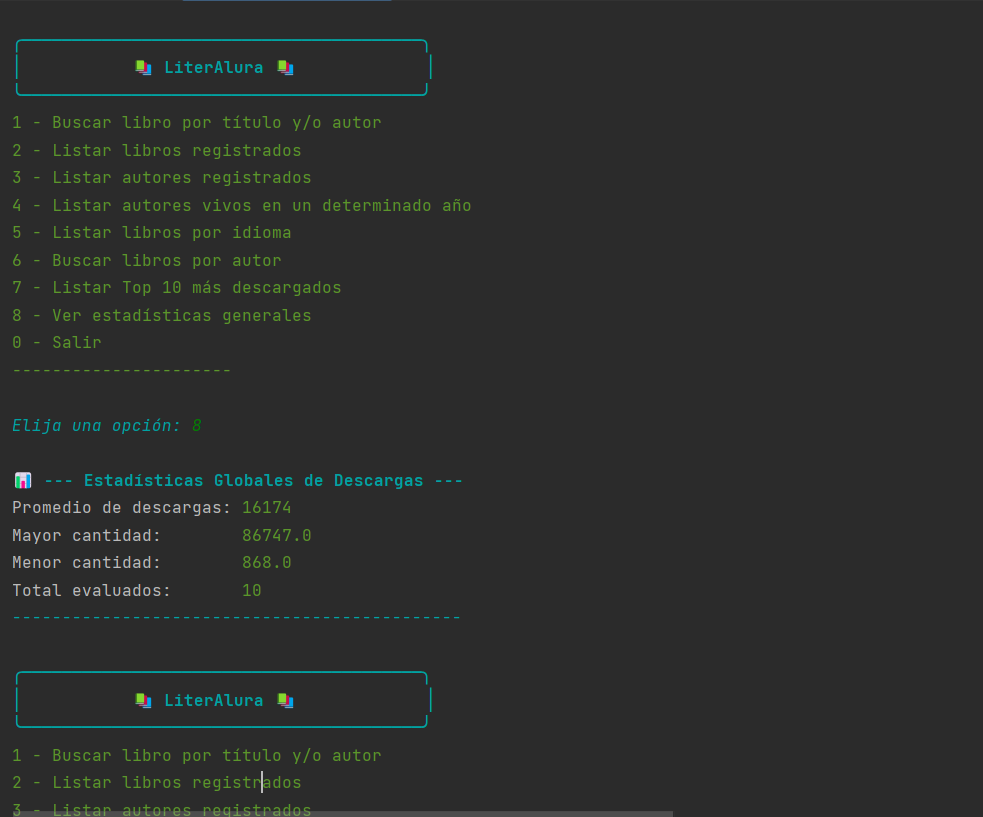
    </td>
  </tr>
  <tr>
    <td align="center">
      <b>Manejo de Errores</b><br>
      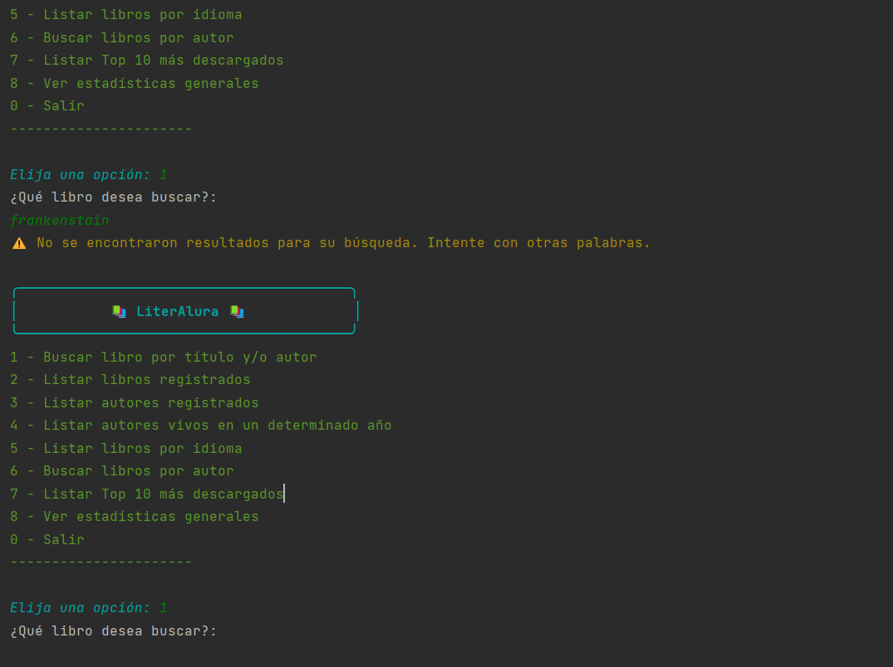
    </td>
    <td align="center">
      <b>Cierre del Programa</b><br>
      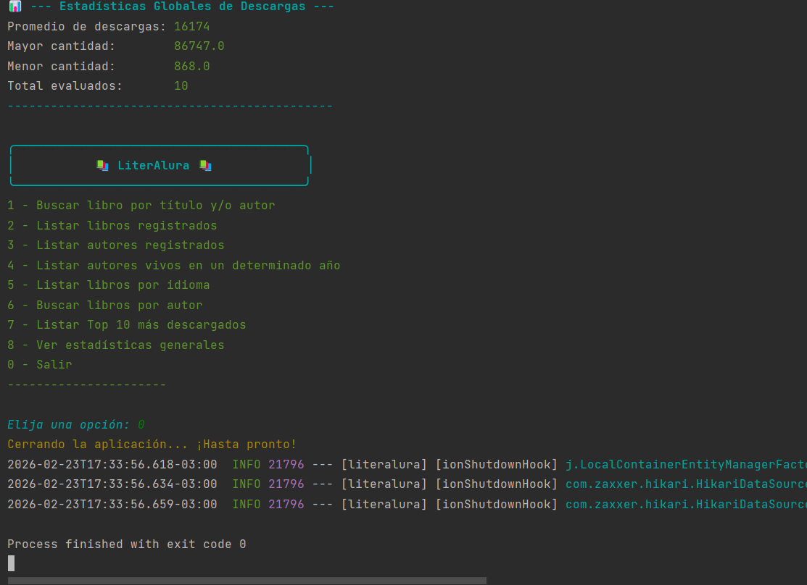
    </td>
  </tr>
</table>

## 👨‍💻 Autor
Desarrollado por Yerko Osorio como parte del Challenge de Backend Java de Alura Latam y Oracle.

***
